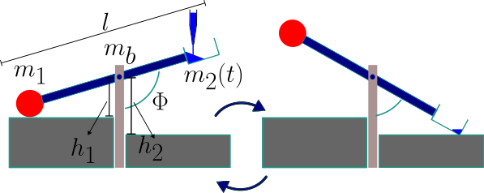

# Codes to simulate the mechanical seesaw/neuron excitable system, better known as Shishi Odoshi or "deer-frightening" or "boar-frightening device which can be found in Japenese gardens.

Set of codes to solve the equation:

$$\ddot{\Phi} = k\sin \Phi$$

With  

$$k=-\left( \frac{g}{l} \right) \frac{ 6(m_1 - m_2) }{ m_b+3(m_1-m_2)}$$

This is the last module on the entries I made for the **exitable systems** series, which are described here. And were used for different outreach activities and courses on **Systems Biology**, **Ordinary Differential Equations** and **Computer Vision** I carried out this last summer (2025).  

As discussed in more detail here. The above equation is nothing but the one of a composed physical pendulum. The rigid rod of mass $m_b$, length $l$ pivoting about an axis crossing the centre of mass of the rod and  with two masses attached at each end of the rod. 



The external stimulus consists of adding water in one end until the centre of mass moves from the end supporting the larger mass to a position closer to the non-supported end. Once the threshold is surpassed, the system starts rotating until it reaches another base and releases some mass, which then drives the system back towards its inital position.

The codes included here are the source code of a C implementation. A Python implementation, and another source C file which was compiled using WASM, to use in the live demo.

## Compilation 

The C code ``neuronc.cc`` can be compiled easily with ``g++ -o neuron neuronc.cc``, which should produce the executable file `neuron`.

For the wasm compilation I used:
``emcc rkseesaw.cc -o rkseesaw.js -sEXPORTED_RUNTIME_METHODS=ccall,cwrap -sEXPORT_ES6 -sMODULARIZE -sMALLOC=dlmalloc -sALLOW_MEMORY_GROWTH=1 -sEXPORTED_FUNCTIONS=_malloc,_free,_boundaryB,_m2t,_boundaryA,_dphi,_ddphi,_rk,_integrals``

Which exposes all the wrapped functions in the source file. It generates the files: `rkseesaw.js` and `rkseesaw.wasm`. Which can be used in a web appilcation.

## Live Demo:

As described in more detail in my other repositories such as [this](https://github.com/calugo/Lorenz-Chua-WASM), the function can be integrated in a JS project, as follows:

1. Declaration

``` 
const mymod = await Module();
var  rkseesaw = mymod.cwrap('integrals', 'number', ['number','number','number','number','number']);
let rn = new Float64Array( Array(NL).fill(1.0) );
let nDataBytes = rn.length * rn.BYTES_PER_ELEMENT;
let dataPtr = mymod._malloc(nDataBytes);
let dataHeap = new Float64Array(mymod.HEAPF64.buffer, dataPtr, nDataBytes);

``` 
2. Call

```

function RK(){
   
rkseesaw(Xo,H,H2,dataHeap.byteOffset,rn.length)
var result = new Float64Array(dataHeap.buffer, dataHeap.byteOffset, rn.length);
.
.
Do Stuff
.
.
}

```

The only important thing to know is that `rkseesaw` takes five arguments:

* Xo: Angle range in which m2 keeps adding mass.
* H: the height of the pivot.
* H2: The height of the base which defines the maximum angle reachable by the seesaw.
* the last two arguments are the buffer containing the result and its length.

3. Live Demo.

A live interactive implementation can be found in the link below:

[Live Demo](https://calugo.github.io/Shishi_Odoshi_Mechanical_Neuron/)

